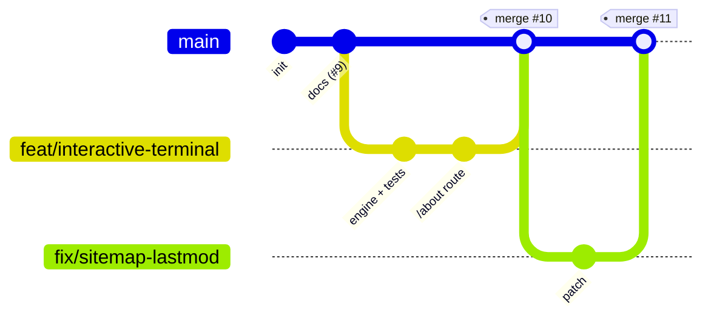
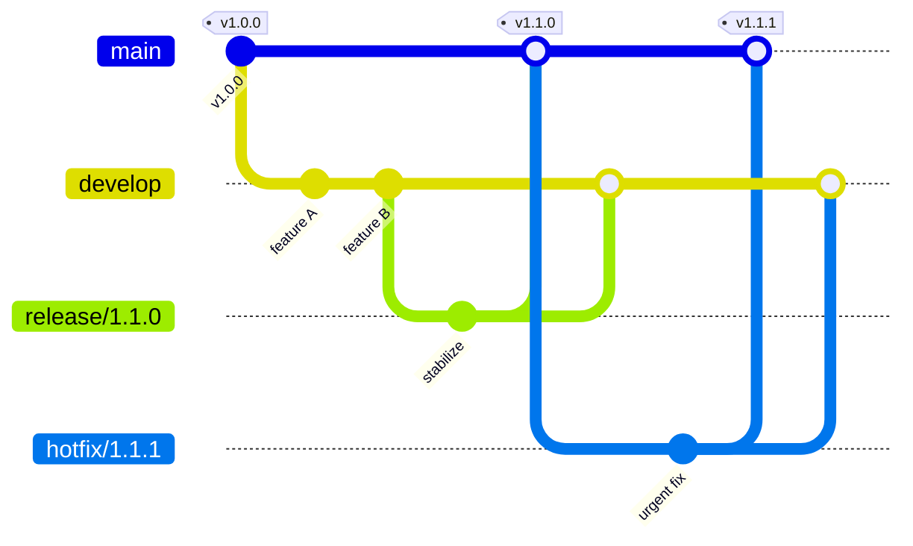

# Git workflow

The branching **strategy** for this repo, with the flow visualized. For the
detailed branch/commit/PR/merge *rules*, see
[`CONTRIBUTING.md`](../CONTRIBUTING.md) — this doc is the map, that one is the
rulebook.

## Strategy: trunk-based GitHub Flow

We use **GitHub Flow** — a lightweight branching model where `main` is the
single long-lived branch and every change lands through a short-lived branch and
a **merge-committed** pull request. It fits a template repo: each PR keeps its
own commits and records an explicit merge point, `main` is always releasable,
and there's no `develop`/`release` bookkeeping to maintain.



Each feature/fix branches off the latest `main`, and the PR is **merged** back
into `main` with a merge commit — so every commit on the branch is preserved and
the merge commit marks where the change landed. Rebase on `main` before merging
(step 6 below) to keep that history clean and easy to follow.

## Branch model

| Branch            | Lifetime    | Branches from | Merges into | Purpose                                    |
| ----------------- | ----------- | ------------- | ----------- | ------------------------------------------ |
| `main`            | permanent   | —             | —           | Always releasable; protected, PR-only      |
| `feat/<slug>`     | short-lived | `main`        | `main`      | New features                               |
| `fix/<slug>`      | short-lived | `main`        | `main`      | Bug fixes                                  |
| `docs/<slug>`     | short-lived | `main`        | `main`      | Documentation only                         |
| `refactor/<slug>` | short-lived | `main`        | `main`      | Behavior-preserving code changes           |
| `chore/<slug>`    | short-lived | `main`        | `main`      | Tooling, deps, config                      |
| `test/<slug>`     | short-lived | `main`        | `main`      | Tests only                                 |

The prefix mirrors the [Conventional Commits](https://www.conventionalcommits.org/)
type of the change, so the branch name, the commits, and the merge-commit
subject all agree.

## Lifecycle of a change

The exact sequence, end to end:

```bash
# 1. Start from an up-to-date main
git checkout main
git pull --ff-only origin main

# 2. Cut a branch named <type>/<short-description>
git checkout -b feat/contact-page

# 3. Commit focused, green changes (Conventional Commits)
git add -A
git commit -m "feat: add contact page"

# 4. Gate locally before pushing — the same checks CI runs
npm run lint && npm run typecheck && npm test && npm run build

# 5. Push and open a PR against main
git push -u origin feat/contact-page
gh pr create --base main --fill

# 6. CI + at least one approving review must pass. Rebase if behind (below),
#    then merge — this creates a merge commit that preserves the branch's commits
gh pr merge --merge --delete-branch

# 7. Sync your local main
git checkout main
git pull --ff-only origin main
```

If a branch falls behind `main`, rebase rather than merge to keep it linear:

```bash
git fetch origin && git rebase origin/main
```

## Releases

`main` is continuously deployable, so a "release" is just a point on `main`.
Tag it with [SemVer](https://semver.org/) when you want a marker:

```bash
git tag -a v0.2.0 -m "v0.2.0" && git push origin v0.2.0
```

Conventional Commit types make the version bump obvious: `fix:` → patch,
`feat:` → minor, a `!`/`BREAKING CHANGE:` → major.

## Scaling up: classic Git Flow (optional)

The model above intentionally omits `develop` and `release/*` branches. If a fork
grows into a versioned product with parallel maintenance releases, adopt the full
[Git Flow](https://nvie.com/posts/a-successful-git-branching-model/) model:
`main` holds tagged releases, `develop` is the integration branch, and
`release/*` + `hotfix/*` branch off as needed.



Only reach for this when the extra branches earn their keep — for a single
always-shippable site, trunk-based GitHub Flow is the lower-overhead default.
